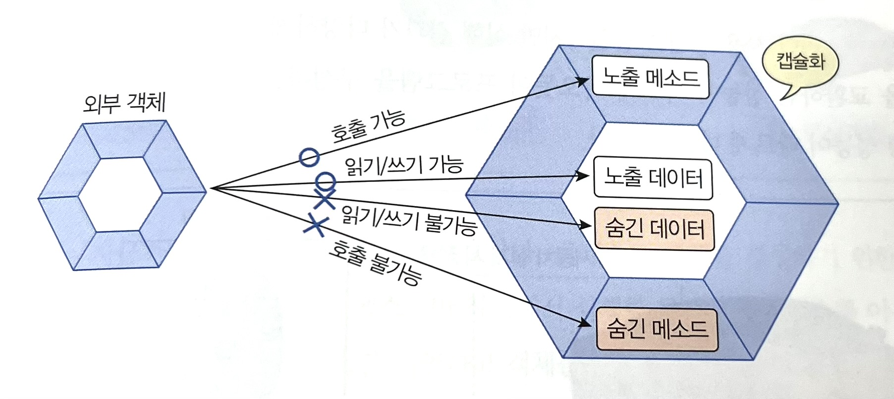
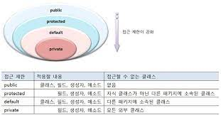

# 6.13 접근 제한자
경우에 따라서는 객체의 필드를 외부에서 변경하거나 메소드를 호출할 수 없도록 막아야 할 필요가 있다. 
중요한 필드와 메소드가 외부로 노출되지 않도록 객체의 **무결성 (결점이 없는 성질)****을 유지하기 위해서이다.


자바는 이러한 기능을 구현하기 위해 접근 제한자(Access Modifier)를 사용한다. 접근 제한자는 public, protected, private의 세 가지 종류가 있다.
(여기서 default는 접근 제한자가 아니라 접근 제한자가 붙지 않은 상태를 말한다.)


## 클래스의 접근 제한 
클래스를 어디에서나 사용할 수 있는 것은 아니다. 클래스가 어떤 접근 제한을 갖느냐에 따라
사용 가능 여부가 결정된다. 클래스는 public과 default 접근 제한을 가질 수 있다.
```java
[public] class 클래스 {...}
```

클래스를 선언할 때 public 접근 제한자를 생략했다면 클래스는 default 접근 제한을 가진다. 이 경우 클래스는 
같은 패키지에서는 아무런 제한 없이 사용할 수 있지만 다른 패키지에서는 사용할 수 없게 된다.